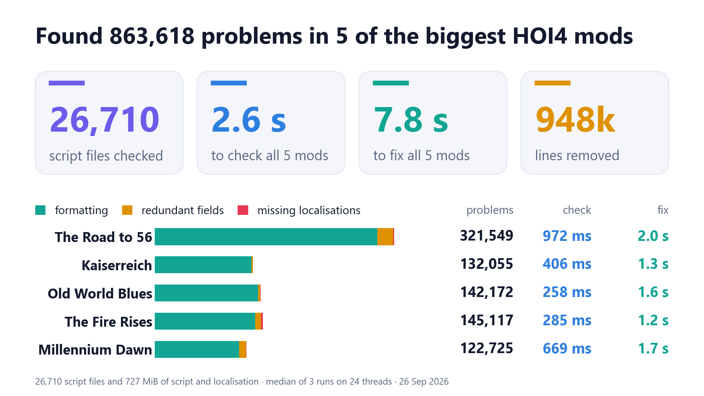

# hearty

[](https://crates.io/crates/hearty)
[](https://crates.io/crates/hearty/dependencies)
[](https://crates.io/crates/hearty)

A formatter and linter for HOI4 mods.

<picture><source media="(prefers-color-scheme: dark)" srcset="docs/charts/dark/hero.png"></picture>

## Installation

### Linux

```bash
curl -L https://github.com/JonathanWoollett-Light/hearty/releases/latest/download/hearty-x86_64-linux.tar.gz | tar xz
./hearty /path/to/mod
```

### Windows (PowerShell)

```powershell
Invoke-WebRequest https://github.com/JonathanWoollett-Light/hearty/releases/latest/download/hearty-x86_64-windows.zip -OutFile hearty.zip
Expand-Archive hearty.zip -DestinationPath .
.\hearty.exe "C:\path\to\mod"
```

### Source

```bash
cargo install hearty
hearty /path/to/mod
```

## GitHub Action

Can be used in a GitHub action with

```yaml
- name: Install hearty
  uses: baptiste0928/cargo-install@v3
  with:
    crate: hearty

- name: Cache HOI4 data
  uses: actions/cache@v4
  with:
    path: .hearty-cache
    key: hoi4-version-cache

- name: Check lints and formatting
  run: hearty --lint --check
```

## Usage

```text
Usage: hearty.exe [OPTIONS] [PATH]

Arguments:
  [PATH]  Path to the mod directory. Defaults to the current directory [default: .]

Options:
      --all                  Check all languages
      --check                Verify formatting without modifying files; exits non-zero on drift
      --fix                  Automatically fix lint findings that support it (e.g. remove fields set to their default value)
      --flamegraph <FILE>    Write an SVG flamegraph of where the run's time went to FILE: each frame's width is the time threads spent in that part (see --timings)
      --format               Apply formatting across all supported file types
      --game-dir <DIR>       Hearts of Iron IV's folder. The lint counts the localisation keys the base game defines as defined, since a mod may use them. Defaults to HEARTY_GAME_DIR, else the game's folder in a Steam library; an empty value leaves the base game out
      --lang <LANG>          Languages to check. May be repeated: --lang english --lang german. Defaults to english if neither --lang nor --all is given [possible values: brazilian_portuguese, chinese, english, french, german, japanese, korean, polish, russian, spanish]
      --lint                 Run linting checks. Enabled by default when no action flag is given
      --max-width <COLUMNS>  Maximum line width (tabs count as 4 columns). Formatting joins a short block onto one line only if the line fits, and rewraps comments of prose with a line wider than this [default: 100]
      --timings              Print a breakdown of where the run's time went to stderr: for each part (action, file, formatter rule, parse, lint step), the time threads spent in it summed over threads, its calls and its share
  -h, --help                 Print help
```

When several actions are given they run in the order `--fix`, `--format`, `--check`, `--lint`, in one pass over the files on every core: each file is read once and written at most once. A file that can't be written is reported, isn't counted as fixed or formatted, and makes hearty exit with an error once everything else is done.

## Documentation

The [rules site](https://jonathanwoollett-light.github.io/hearty/) lists every formatting rule and lint, with examples:

- [**Formatting**](https://jonathanwoollett-light.github.io/hearty/#formatting): `--format` rewrites the `*.txt` files under `common/`, `events/` and `history/`. It sorts focuses after their prerequisites and events after the events that fire them, puts the fields of focuses, decisions, events and other definitions in vanilla's order, joins short blocks onto one line, normalises spacing, and rewraps prose comments wider than `--max-width`. `--check` makes no changes and exits non-zero if any file would change.
- [**Lints**](https://jonathanwoollett-light.github.io/hearty/#lints): `--lint` reports events, focuses and technologies without localisation, duplicate keys and an outdated `supported_version` in `descriptor.mod`, and redundant fields such as `fire_only_once = no`, which `--fix` removes.

[Development](docs/development.md) covers testing, profiling, benchmarking and the roadmap.

## Licence

hearty is licensed under MIT. The release binaries also contain its dependencies, under their own licences: among them [inferno](https://crates.io/crates/inferno), which draws `--flamegraph`'s SVG, is under CDDL-1.0, and its source is at <https://github.com/jonhoo/inferno>.
