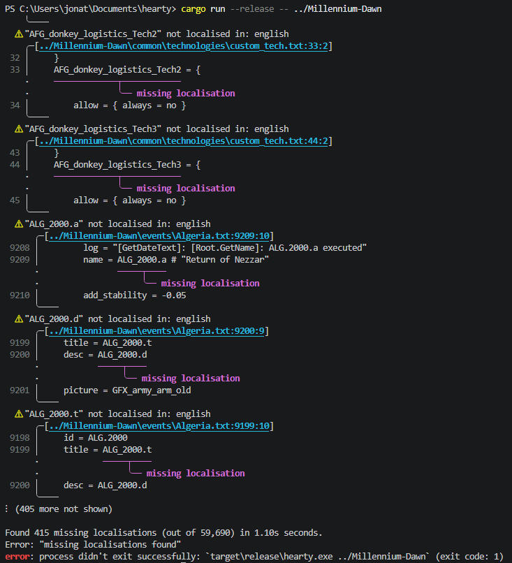
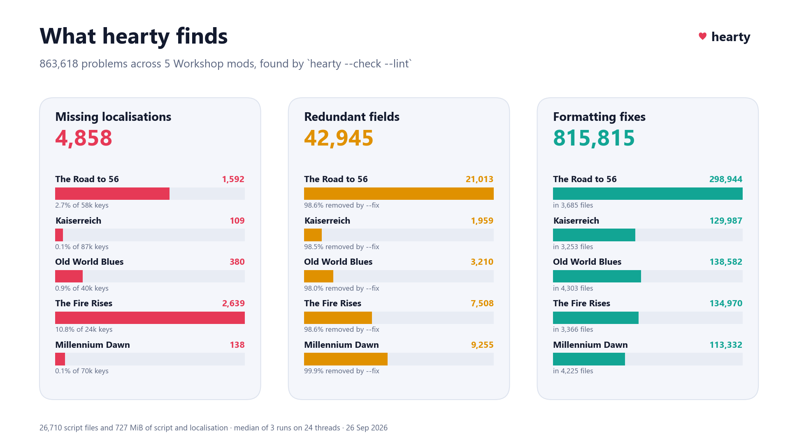
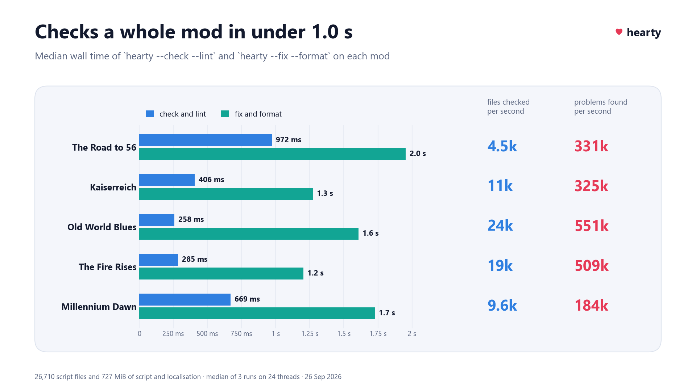

# hearty

[](https://crates.io/crates/hearty)
[](https://crates.io/crates/hearty/dependencies)
[](https://crates.io/crates/hearty)

<picture><source media="(prefers-color-scheme: dark)" srcset="docs/charts/dark/hero.png"></picture>

### Installation

#### Linux 

```bash
curl -L https://github.com/JonathanWoollett-Light/hearty/releases/latest/download/hearty-x86_64-linux.tar.gz | tar xz
./hearty /path/to/mod
```

#### Windows (PowerShell)
```powershell
Invoke-WebRequest https://github.com/JonathanWoollett-Light/hearty/releases/latest/download/hearty-x86_64-windows.zip -OutFile hearty.zip
Expand-Archive hearty.zip -DestinationPath .
.\hearty.exe "C:\path\to\mod"
```

#### Source

```bash
cargo install hearty
hearty /path/to/mod
```

### GitHub Action

Can be used in a GitHub action with
```yaml
- name: Install hearty
    uses: baptiste0928/cargo-install@v3
    with:
        crate: hearty

- name: Cache HOI4 data
  uses: actions/cache@v4
  with:
    path: .hearty-cache
    key: hoi4-version-cache

- name: Check lints and formatting
    run: hearty --lint --check
```

### Usage

```text
Usage: hearty.exe [OPTIONS] [PATH]

Arguments:
  [PATH]  Path to the mod directory. Defaults to the current directory [default: .]

Options:
      --all                  Check all languages
      --check                Verify formatting without modifying files; exits non-zero on drift
      --fix                  Automatically fix lint findings that support it (e.g. remove fields set to their default value)
      --flamegraph <FILE>    Write an SVG flamegraph of where the run's time went to FILE: each frame's width is the time threads spent in that part (see --timings)
      --format               Apply formatting across all supported file types
      --game-dir <DIR>       Hearts of Iron IV's folder. The lint counts the localisation keys the base game defines as defined, since a mod may use them. Defaults to HEARTY_GAME_DIR, else the game's folder in a Steam library; an empty value leaves the base game out
      --lang <LANG>          Languages to check. May be repeated: --lang english --lang german. Defaults to english if neither --lang nor --all is given [possible values: brazilian_portuguese, chinese, english, french, german, japanese, korean, polish, russian, spanish]
      --lint                 Run linting checks. Enabled by default when no action flag is given
      --max-width <COLUMNS>  Maximum line width (tabs count as 4 columns) up to which formatting joins a short block onto one line [default: 100]
      --timings              Print a breakdown of where the run's time went to stderr: for each part (action, file, formatter rule, parse, lint step), the time threads spent in it summed over threads, its calls and its share
  -h, --help                 Print help
```

When several actions are given they run in the order `--fix`, `--format`, `--check`, `--lint`. hearty reads each file once and takes it through them in that order, on every core at once, and writes it at most once. A file that can't be written is reported, isn't counted as fixed or formatted, and makes hearty exit with an error once everything else is done.

hearty uses the [mimalloc](https://github.com/microsoft/mimalloc) allocator, which is much faster than the system allocator when every core allocates at once, but holds on to more memory: on Millennium Dawn or vanilla HOI4, `--check` and `--format` peak at 0.3–0.7 GB of RAM (up to 0.9 GB committed), and `--lint` at 0.15–0.35 GB.

### Formatting

`--format` (and `--check`) cover `*.txt` files under `common/`, `events/` and `history/`:

- Focuses are sorted so each comes after its prerequisites and the focus it's positioned relative to (`relative_position_id`); otherwise they keep their order. Events are sorted so event chains stay together: chains come in natural order of their first event id (`x.2` before `x.10`), and so do the events of a chain, after the events that fire them. A focus or event moves together with the comment lines right above it and any comment after its closing brace. Anything else after its closing brace (another entry, or the `}` closing the focus tree) stays where it is, on a line of its own. A focus tree is left unsorted if a focus to move doesn't start its own line, and so is an event file if an event to move doesn't. A whole file is left unsorted if it doesn't parse, if two focuses of a tree or two events share an id, or if the order they must follow has a cycle.
- Fields of definition blocks (focuses, decisions, decision categories, events, event options, ideas, characters and their roles, technologies) are put in a canonical order, e.g. a decision's `icon` comes before its `complete_effect`. The orders follow what vanilla HOI4 does. Fields hearty doesn't know stay where they are, and repeated fields (several `option`s, `prerequisite`s, ...) keep their relative order.
- Short blocks with a single `key = value` entry, or a plain list of values, are joined onto one line when the line fits within `--max-width`:
  ```text
  prerequisite = {          ->   prerequisite = { focus = my_focus }
      focus = my_focus
  }
  ```
  Blocks with comments, several `key = value` entries or nested blocks, empty blocks and definition blocks are left over several lines. Blocks already on one line are never split.
- Spacing is normalised: `x=-1` becomes `x = -1`, and `{a = b}` becomes `{ a = b }`.

Every run prints the lines added and removed per file, plus a summary of what changed:

```text
Formatted 3 files:
  common/decisions/malta.txt           +4  -10  (3 blocks joined onto one line, 1 block with reordered fields, 1 spacing fix)
  common/national_focus/bulgaria.txt  +20  -13  (7 blocks with reordered fields, 5 focuses moved, 5 spacing fixes)
  events/germany.txt                  +19  -19  (4 events moved)
3 files changed, 43 insertions(+), 42 deletions(-)
Changes: 3 blocks joined onto one line, 4 events moved, 8 blocks with reordered fields, 5 focuses moved, 6 spacing fixes
```

### Lints

- Missing localisation keys for events (titles, descriptions and option names in `events/*.txt`), focuses (ids in `common/national_focus/*.txt`) and technologies (`common/technologies/*.txt`). Localisation is read from the `.yml` files under `localisation/` whose names end with `l_<language>.yml` (including `replace/`), and only for the languages checked. Most mods reuse vanilla events, focuses and ideas, so the base game's own localisation counts too, except for the folders the mod's `descriptor.mod` replaces with `replace_path` (not their subfolders). hearty finds Hearts of Iron IV in your Steam libraries, or takes its folder from `--game-dir` or `HEARTY_GAME_DIR`. Where the game isn't installed, such as in CI, keys only the base game defines are reported as missing, and the output says so. Set `HEARTY_GAME_DIR` to an empty value to leave the game out on purpose. Each missing key is shown where it's defined, and a key used in several files is shown in the first of them. Keys are reported as written, non-ASCII ones included. A title, description or option name in square brackets (`title = "[GetTitle]"`) is scripted localisation, which the game shows in place of a key, so it isn't reported.
- `descriptor.mod` duplicate keys, and a `supported_version` that doesn't match the latest HOI4 release.
- Redundant fields: fields set to their default value, or that otherwise have no effect, such as `fire_only_once = no` in a decision, `cancel_if_invalid = yes` in a focus or `available = { }`. `--fix` removes them. It won't remove a field if a comment would be deleted along with it.

### Example



### Profiling

`--timings` prints where a run's time went to stderr, and `--flamegraph FILE` draws the same as an SVG flamegraph (open it in a browser: hover over a frame for its time, click to zoom). They work with any actions and don't change what the actions do. For example, `hearty --check --lint --timings` on Millennium Dawn:

```text
Timings: 603.21ms wall, 11.50s active on 26 threads (rayon pool: 24), parallelism 19.07x
  active: time threads spent in a span and the spans under it, summed over threads
  self:   active time not spent in a span nested in it on the same thread
  share:  active time as a share of the total; wall: first to last moment of a top-level part

span                    active      self  calls  share      wall
scripts                 11.38s    0.00ns      1  98.9%  571.09ms
  file                  11.38s   74.50ms  6,457  98.9%
    check               10.54s  212.89ms  6,457  91.5%
      line stats         7.80s     7.80s  4,236  67.8%
      inline             1.02s  421.04ms  6,457   8.8%
        parse         600.13ms  600.13ms  4,106   5.2%
      parse           828.63ms  828.63ms  6,647   7.2%
      field order     605.86ms  230.78ms  6,457   5.2%
        parse         375.08ms  375.08ms    737   3.2%
      … 2 more         64.51ms                    0.5%
    read              604.86ms  604.86ms  6,457   5.2%
    lint              168.64ms    7.19ms  6,457   1.4%
      redundant find  154.17ms  154.17ms  6,457   1.3%
      … 1 more          7.27ms                    0.0%
localisation load      65.08ms    0.00ns      1   0.5%  571.09ms
  file                 65.08ms  953.40µs    296   0.5%
    … 2 more           64.13ms                    0.5%
find files             32.33ms    0.00ns      1   0.2%    7.65ms
  … 1 more             32.33ms                    0.2%
report                 19.70ms   25.40µs      1   0.1%   22.23ms
  … 4 more             19.67ms                    0.1%
version check           2.82ms   86.50µs      1   0.0%    2.83ms
  … 2 more              2.74ms                    0.0%
```

- **active** is the time threads spent in a part, including the parts under it, summed over threads. Files are formatted and linted on every core at once, so a part's active time can be many times the run's wall time. A thread waiting for others counts nothing.
- **self** is active time not spent in a part nested in it on the same thread.
- **share** is the part's share of the total active time. Parts under 0.5% are folded into a `… N more` line.
- **wall** is the time from the start to the end of a top-level part: finding the files, the pass over the script files (each file is read, fixed, formatted, written, checked and linted in turn), loading the localisation (alongside that pass), the version check (on a thread of its own) and printing the report.
- **parallelism** is total active time over wall time: how many threads were busy on average.

The flamegraph shows the same tree: a frame's width is its active time.

### Benchmarking

`cargo bench --bench millennium_dawn` benchmarks hearty on the `main` branch of [Millennium Dawn](https://github.com/MillenniumDawn/Millennium-Dawn), a large mod.

- The first run clones the mod into `target/tmp/Millennium-Dawn`. The clone is shallow, blobless and sparse (`common`, `events`, `history`, `localisation` and the root files), so it takes about 30 seconds and 470 MiB (380 MiB of files and 90 MiB of `.git`). Later runs fetch `main` into that clone and reset it, so they only download what changed. Set `HEARTY_BENCH_DIR` to clone somewhere else. The clone is made in `Millennium-Dawn.partial` beside it and only moved into place once it's complete, so if a clone fails or is stopped, the next run starts it again. The benchmark only resets a clone it made, so pointing it at an existing checkout fails instead of discarding changes.
- It runs `--check --lint`, `--fix --format`, then each of `--lint`, `--check`, `--fix` and `--format` on its own: once to warm up, then 3 timed runs, and prints the fastest, median and slowest. Runs that change files are undone with `git reset --hard` and `git clean` before the next one, and then every file is read once, as on Windows the first read of a file after it's written waits for the antivirus to scan it.
- `--check --lint` and `--fix --format` then run once more with `--timings` and `--flamegraph`. The benchmark prints their breakdowns and writes the flamegraphs to `target/tmp/flamegraph-check-lint.svg` and `target/tmp/flamegraph-fix-format.svg`.
- The HOI4 version cache is kept in `target/tmp/hearty-cache`, so steamcmd only runs on the first warm-up of the day.

`cargo test` doesn't run the benchmark, but `tests/bench_checkout.rs` tests its clone and fetch against a small local repository (this needs git).

#### Steam Workshop mods

`cargo bench --bench workshop_mods` runs the same scenarios on five large Steam Workshop mods: [The Road to 56](https://steamcommunity.com/sharedfiles/filedetails/?id=820260968), [Kaiserreich](https://steamcommunity.com/sharedfiles/filedetails/?id=1521695605), [Old World Blues](https://steamcommunity.com/sharedfiles/filedetails/?id=2265420196), [The Fire Rises](https://steamcommunity.com/sharedfiles/filedetails/?id=3350890356) and [Millennium Dawn](https://steamcommunity.com/sharedfiles/filedetails/?id=2777392649) (its Workshop release; the benchmark above runs its `main` branch). Set `HEARTY_BENCH_MODS` to a comma-separated list of slugs (`road-to-56`, `kaiserreich`, `old-world-blues`, `the-fire-rises`, `millennium-dawn`) or Workshop ids to run only some.

- **Getting the mods.** HOI4 isn't free, so steamcmd can't download its Workshop items anonymously. Each mod is taken from the first of:
  1. the folder in `HEARTY_BENCH_MOD_<id>`, e.g. `HEARTY_BENCH_MOD_1521695605`;
  2. the Workshop folder of any Steam library (`steamapps/workshop/content/394360/<id>`), so subscribing to a mod is enough. Steam is found in its default locations and, on Windows, the registry; set `HEARTY_BENCH_STEAM_DIR` to add another installation;
  3. a steamcmd download, when `HEARTY_BENCH_STEAM_USER` names a Steam account that owns HOI4. steamcmd must already hold its login: run `steamcmd +login <user> +quit` once. Set `HEARTY_BENCH_STEAMCMD` if steamcmd isn't on `PATH`.

  A mod found in none of these is skipped, with a message saying how to provide it.
- **Never touching Steam's copy.** The files hearty reads (`descriptor.mod`, `common`, `events`, `history` and `localisation`) are synced byte for byte into a git working copy in `target/tmp/workshop-mods/<slug>` (set `HEARTY_BENCH_WORKSHOP_DIR` to move it). Runs that change files are undone with `git reset`, and later benchmark runs only copy the files the mod has changed.
- **Results.** Everything is written to `target/tmp/workshop-mods/results.json`: each scenario's timings, the `--timings` breakdowns, and the problems hearty found (missing localisations, redundant fields, files `--format` would change and how, and `descriptor.mod` warnings). The flamegraphs go next to it.

Draw charts of the results with `python scripts/plot_benchmarks.py` (needs `pip install matplotlib`). It writes 1920x1080 charts to `target/tmp/workshop-mods/charts/`: the ones below and the one at the top, plus `execution_time.png`, `formatting_changes.png` and `time_breakdown.png` in more detail. Options: another `results.json`, `--out DIR`, `--theme light`, `--format svg` or `pdf`, and `--only CHART ...`. The README's charts are in `docs/charts`, made with `--out docs/charts/dark --only hero problems speed`, then the same with `--theme light` into `docs/charts/light`.

<p><picture><source media="(prefers-color-scheme: dark)" srcset="docs/charts/dark/problems.png"></picture> <picture><source media="(prefers-color-scheme: dark)" srcset="docs/charts/dark/speed.png"></picture></p>

`tests/bench_workshop.rs` tests reading hearty's output, finding Steam libraries and syncing a mod (this needs git).

### Todo

In no particular order.

- Check events can be fired (sometimes old events end up existing in code but never being used, just being clutter).
- Check focuses, events, etc. have gfx.
- Check localisation spelling and grammar.
- Lint events that come before an event firing them, which `--format` can't fix when the file can't be sorted (e.g. its events fire each other in a cycle).